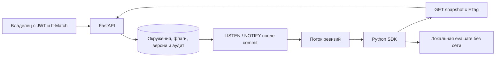

# Как устроен FlagHarbor

Окружение принадлежит одному пользователю. При изменении API блокирует его строку, сверяет `If-Match` с revision и сохраняет правило. Соль существующего флага сохраняется. Новая версия, запись аудита и `pg_notify` входят в ту же транзакцию. Если аудит не записался, само изменение тоже откатывается.

Снимок читается в `REPEATABLE READ`: версия окружения и все правила относятся к одному состоянию базы. Уведомление содержит только идентификатор окружения. На каждом процессе API одна выделенная LISTEN-сессия раздаёт сигнал подписчикам этого окружения; очередь подписчика ограничена одним сигналом, поскольку клиенту нужен последний снимок, а не каждое промежуточное состояние.

Уведомления PostgreSQL не являются долговечным журналом доставки. SSE раз в пять секунд дополнительно проверяет версию и ключ; SDK также опрашивает снимок раз в две секунды. Потеря LISTEN-соединения вызывает переподключение, а потерянное уведомление не оставляет кеш навсегда старым.

Ключ SDK авторизует только чтение одного окружения. При ротации меняются его хеш и версия, а аудит не сохраняет ни старое, ни новое значение секрета. Старый SDK получает 401 или SSE `revoked` и сразу очищает кеш. Сетевой разрыв задерживает получение отзыва; старое значение может жить до `max_stale`.

Процент вычисляется по SHA-256 от `[environment_id, salt, stickiness, identity]`, сериализованных однозначным JSON. Первые 64 бита переводятся в bucket 0–9999. Проверка `bucket < rollout_bps` делает группы вложенными при расширении процента. Python `hash()` не используется, поэтому перезапуск процесса не меняет аудиторию.

Ограничения текущей версии: до 10 окружений у пользователя, 100 флагов в окружении и 100 SSE-подписок на процесс API. Редактор один по правам владения, командных ролей внутри окружения пока нет. Распределённый аудит, экспорт и удаление старых событий не реализованы.
